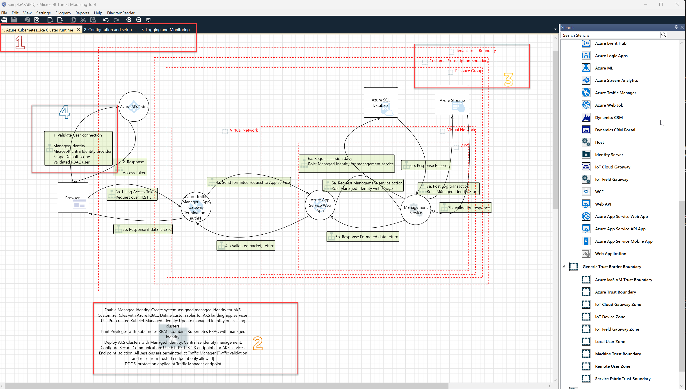

 
What Makes a Good Threat Model?
In the realm of cybersecurity, threat modeling plays a pivotal role in safeguarding systems and applications against potential risks. A well-constructed threat model provides valuable insights into vulnerabilities, attack vectors, and mitigation strategies. Let’s delve into what distinguishes a good threat model from a subpar one.

1. Picking the right tool: 
Selecting an appropriate tool for threat modeling is crucial in ensuring effective security analysis. In this article we will use the Microsoft Threat Modeling tool. Key consideration including 
a.	Scope: Consider tools that align with your scope—some cater to web applications, while others cover broader infrastructure.
b.	Ease of Use: Opt for tools that strike a balance between robustness and simplicity. Complex tools may overwhelm users, hindering adoption. Look for intuitive interfaces and clear documentation.
c.	Methodology Compatibility: Different threat modeling methodologies exist (e.g., STRIDE, DREAD, or OCTAVE). In this article we will focus on STRIDE  

2. Clarity and Communication:
A bad threat model is one that remains cryptic, inaccessible to non-security professionals. To create a good threat model, we must ensure it can be effectively communicated to developers, senior leadership, and other stakeholders. Clarity is key. When everyone understands the threats, they can actively contribute to securing the system.
3. Input Matters:
A bad threat model starts with flawed input—garbage in, garbage out. Avoid overly complex models that hinder understanding. For instance, Data Flow Diagram (DFD)-based threat modeling can be cumbersome, lacking detailed context and scalability. Instead, opt for simplified approaches that capture the entire system and provide a comprehensive view of the interconnected environment.
4.  Attack Surface Exploration:
A good threat model seeks to understand the system’s attack surface. Developers, not just experts, should engage in threat modeling. Collaborative exercises empower developers to build threat models, while security experts offer guidance when needed. By involving the entire team, we enhance security awareness and foster a proactive mindset.
5.  Simplicity and Practicality:
Threat modeling need not be an arcane art. Simplify the approach. Demanding that DevOps teams master DFD-based threat modeling isn’t practical. Instead, focus on security controls that resonate with the team. Remember, not everyone is a security expert, but everyone can contribute to a safer system.
6.  Validation and Verification:
A good threat model doesn’t stop at identification—it validates and verifies. It outlines potential threats, proposes mitigation strategies, and ensures successful implementation. Regular reviews and updates keep the model relevant as the threat landscape evolves.

What information to include?
•	Components
All components that interact, or are involved within your service should be included in your Threat Model diagram.  This includes components like storage resources, virtual machines, etc.  
•	Data Flow Directions
Specify the interactions and exchange of information between components, including the direction of data flow. 
•	Trust boundaries
When data flows intersect a particular boundary (network, machine boundary, domains, etc.), a trust boundary will need to be specified. This can be represented as a line, dividing the ends of a data flow, or a self contained "box" containing the relevant components and interactions.

What does a good threat model diagram look like?
The following diagram is an example of a good threat model diagram. It is a re-worked version of a threat model diagram as a sample design of an AKS based web service.

  

1.) Have separate diagrams to describe different flows and logical components of the service

Breaking a large threat model diagram down to smaller diagrams.  Smaller diagrams describe different flows and logical components help with managing future updates (to the diagram) and abstracting away complexities. It makes it easier to follow and present the service during the threat model review meeting.    

2.) Include brief high-level descriptions to set context

Sometimes it is difficult to understand the context and purpose of a specific part of the service by looking at its components and interactions. Having a brief description to set the context helps with brainstorming potential threats and risks.

3.) Specify the trust boundaries for your service

Trust boundaries can be on a network-level, machine-level, or domain-level, to name a few. They define divisions where the level of trust changes due to differing environmental conditions and settings. There may be security and/or privacy risks associated with data crossing trust boundaries.

4.) Descriptive components and interactions

Be as descriptive (but also as concise) as possible when describing components and interactions within the service as it helps with setting context. Attributes can be set on components and data flow directions to add metadata. This metadata is used to render icons (e.g. a key to indicate an HTTPS connection) as a means, alternative to text, to convey information, and can also be used to auto-generate threats.

________________________________________
References:
1.	<a href = "https://www.forbes.com/sites/forbestechcouncil/2020/12/21/what-makes-a-good-threat-model/" >What Makes A Good Threat Model? - Forbes</a> 
2.	<a href = "https://owasp.org/www-community/Threat_Modeling">Threat Modeling | OWASP Foundation</a> 
3.	<a href = "https://www.varonis.com/blog/threat-modeling">What is Threat Modeling and How To Choose the Right Framework - Varonis</a> 
4.	<a href = "https://cheatsheetseries.owasp.org/cheatsheets/Threat_Modeling_Cheat_Sheet.html">Threat Modeling - OWASP Cheat Sheet Series</a> 

