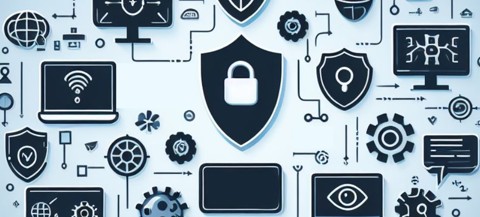
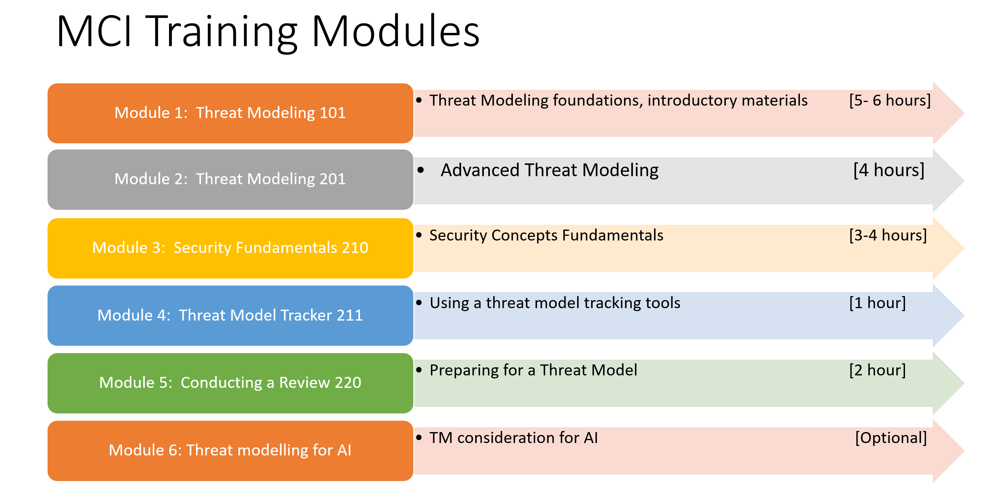

# Threat Modeling Reviewer Program 
## Extending the Microsoft Threat Modeling program for peer teams
  

The purpose of the  Security training is to demystify the security review process in Secure Development Lifecycle (SDL) and to develop and cultivate techniques and skills to help you be security minded in your solutions and serve as Threat Model Reviewers.

 

Goal:  High quality reviews of everything you build

Training Goal:  The goal of the Security Review training content is to provide you with a solid and well-rounded security and threat model foundation and the necessary tools and resources to conduct quality threat model reviews and security consultations.  This training allows us to share the responsibilities to actively /shift left and to continue to develop security interested engineers. 

 

What does success look like? Completing the modules, preparing for the tabletop exercise, and serving as a peer reviewerto effectively review solutions with security focus.

 

 Security Program built out in 2024 provides an engineering led security peer review program to help ensure we build solutions secure by design, and by default.

The  Security Program serves two primary functions: 1) security integration and engineer buy- in and 2) a scalable process that actively and continuously is /shifting left.  

 

If you are here and ready to start - the next steps are to:

Learn: Completing by reading and watching to collected knowledge in the modules, which will take you through the entire program and provide you a good understanding how to conduct a review.

  

